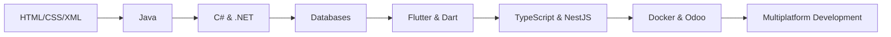

<div align="center">

# 👋 Hi there! I'm Yonderus

### 💻 Multiplatform Application Developer (DAM)

[](https://github.com/Yonderus)
[](https://github.com/Yonderus)

</div>

---

## 🚀 About Me

I'm a **DAM** (Multiplatform Application Development) developer passionate about creating innovative technological solutions. I specialize in developing applications for multiple platforms, from desktop applications to mobile and web.

```python
class Developer:
    def __init__(self):
        self.name = "Yonderus"
        self.role = "DAM Developer"
        self.learning = "Always learning"
        self.passion = ["Clean code", "New technologies", "Problem solving"]
    
    def say_hi(self):
        print("Thanks for visiting my profile! 👨‍💻")

me = Developer()
me.say_hi()
```

---

## 🛠️ Tech Stack & Experience Level

### 🌐 Frontend & Web
<div align="left">
  


</div>

```text
HTML5       ██░░░░░░░░ 25% (Basic)
CSS3        ██░░░░░░░░ 25% (Basic)
XML         ███████░░░ 70% (Intermediate)
XSLT        ███████░░░ 70% (Intermediate)
XPath       ███████░░░ 70% (Intermediate)
```

### 💾 Backend & Programming Languages
<div align="left">
  


</div>

```text
Java        ████████░░ 80% (Advanced)
C#          █████████░ 90% (Advanced)
Python      ███░░░░░░░ 35% (Basic-Intermediate - Odoo)
TypeScript  ███░░░░░░░ 30% (Basic)
Dart        █████░░░░░ 55% (Intermediate)
```

### 🎯 Frameworks & Libraries
<div align="left">
  


</div>

```text
.NET        █████████░ 90% (Advanced)
NestJS      █████░░░░░ 50% (Intermediate)
Flutter     █████░░░░░ 55% (Intermediate)
WPF         █████████░ 85% (Advanced)
WinForms    ████████░░ 80% (Advanced)
```

### 🗄️ Databases
<div align="left">
  


</div>

```text
SQL         ████████░░ 85% (Advanced)
MongoDB     ███████░░░ 70% (Intermediate-Advanced)
```

### 🔧 Tools & Technologies
<div align="left">
  


</div>

```text
Docker          ██████░░░░ 60% (Intermediate)
Odoo            ██████░░░░ 60% (Intermediate)
Crystal Reports ███████░░░ 70% (Intermediate-Advanced)
Git             ████████░░ 80% (Advanced)
```

---

## 📊 GitHub Stats

<div align="center">
  


</div>

---

## 🎯 Featured Projects

### 🏋️ [DeportRentAPP](https://github.com/Yonderus/DeportRentAPP)
Sports management application developed with **TypeScript** and **NestJS**.

### 📱 [Respi](https://github.com/Yonderus/Respi)
Cross-platform mobile application developed with **Flutter** and **Dart**.

### 🏢 [Practica_Moduls_Odoo](https://github.com/Yonderus/Practica_Moduls_Odoo)
Custom modules for **Odoo** developed in **Python**.

### 🎵 [Proyecto_Final_Banda_Musica](https://github.com/Yonderus/Proyecto_Final_Banda_Musica)
Music band management system with **C#** and **.NET**.

### 🏢 [Centro-Deportivo-Testing-y-Distribucion](https://github.com/Yonderus/Centro-Deportivo-Testing-y-Distribucion)
Sports center management project with testing and distribution.

---

## 📈 Learning Journey



---

## 🎓 Areas of Expertise

<table>
<tr>
<td width="50%">

### 💪 Strengths

- ✅ **Desktop Development** (.NET, WPF, WinForms)
- ✅ **Databases** (SQL Server, MongoDB)
- ✅ **Object-Oriented Programming** (Java, C#)
- ✅ **Reporting** (Crystal Reports)
- ✅ **Version Control** (Git)

</td>
<td width="50%">

### 🌱 Currently Improving

- 🔹 **Flutter/Dart** for mobile apps
- 🔹 **TypeScript** & modern architectures
- 🔹 **NestJS** backend development
- 🔹 **Python** for Odoo
- 🔹 **Docker** & containerization
- 🔹 **Modern Frontend** (HTML5, CSS3)

</td>
</tr>
</table>

---

## 📫 Connect with Me

<div align="center">

[](https://github.com/Yonderus)
[](#)
[](mailto:your.email@example.com)

</div>

---

<div align="center">
  
### 💡 "Code is poetry in a language machines understand"


⭐️ From [Yonderus](https://github.com/Yonderus)

</div>
